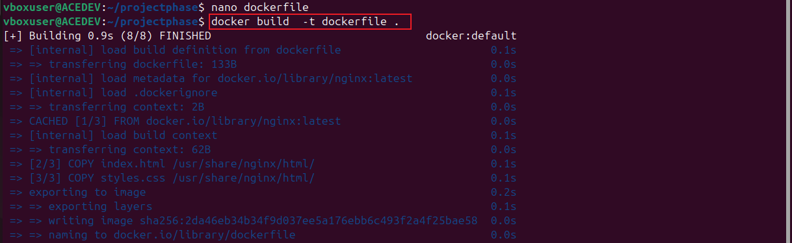

# Containerization-and-Container-Orchestration
containerize and deploy your frontend application using Docker and Kubernetes

# Phase 1: Basic Frontend Application with Docker and Kubernetes

1. Set up your project
Create a new project directory:

       mkdir projectphase

Inside the directory, add an "index.html" and a "styles.css" file for the static website:

         nano index.html
         nano styles.css

2. Initialize Git
Run git init in the project directory to initialize a Git repository:

        git init

3. Git Commit
Add your files and commit them with:

       git add .
       git commit -m "Initial commit"

4. Dockerize the application
Create a Dockerfile:

       FROM nginx:latest
       COPY index.html /usr/share/nginx/html/
       COPY styles.css /usr/share/nginx/html/

  
      
Build the Docker image:

     docker build -t your-image-name 

 5. Push to Docker Hub
Log in with docker login.

Push your image:

    docker tag your-image-name your-dockerhub-username/your-image-name
    docker push your-dockerhub-username/your-image-name
    
6. Set up a Kind Kubernetes Cluster
Install Kind (kind).

    curl -Lo ./kind https://kind.sigs.k8s.io/dl/latest/kind-linux-amd64
    chmod +x ./kind
    sudo mv ./kind /usr/local/bin/kind
    kind version

Create a cluster:

    kind create cluster
    
7. Deploy to Kubernetes
Create a Kubernetes Deployment YAML file (deployment.yaml):
     
     nano deployment.yaml

script: 

    apiVersion: apps/v1
    kind: Deployment
    metadata:
       name: frontend-deployment
    spec:
      replicas: 2
    selector:
    matchLabels:
        app: frontend
    template:
    metadata:
      labels:
        app: frontend
    spec:
      containers:
      - name: frontend
        image: your-dockerhub-username/your-image-name
        ports:
        - containerPort: 80
        
* Apply the deployment:

      kubectl apply -f deployment.yaml

8. Create a Kubernetes Service
      
      nano service.yaml

       apiVersion: v1
       kind: Service
       metadata:
          name: frontend-service
       spec:
          selector:
          app: frontend
       ports:
          - protocol: TCP
          port: 80
          targetPort: 80
       type: ClusterIP

* Apply it:

      kubectl apply -f service.yaml

9. Access the Application
* Forward the port:
   
      kubectl port-forward svc/frontend-service 8080:80

